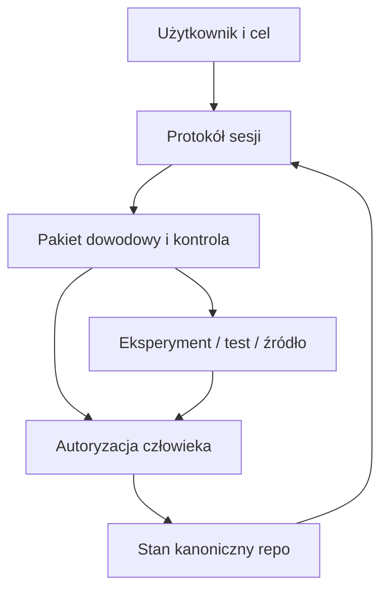
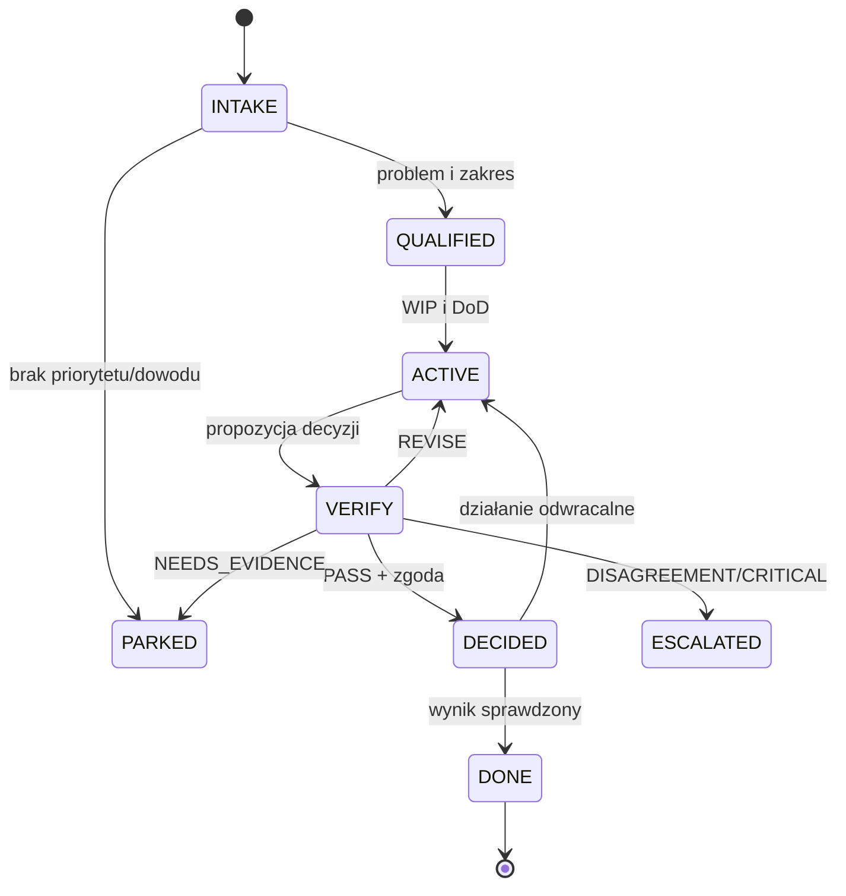

# Architektura operacyjna v0

## 1. Cel architektury

Architektura ma być wystarczająca do przeprowadzenia pilota i wystarczająco mała, aby sama nie stała się projektem zastępczym. Nie zakłada agentów działających stale, bazy wektorowej, automatycznych commitów ani uczenia modelu na prywatnych transkrypcjach.

## 2. Warstwy



### Warstwa 1: kontrakt

`00_KONTRAKT_PRACY_Z_AI.md` opisuje obserwowalne preferencje i reguły współpracy. Nie jest profilem psychologicznym i nie może nadawać modelowi dodatkowych uprawnień.

### Warstwa 2: stan sterujący

`01_KOMPAS.md`, `02_KANON.md`, `03_AKTYWNY.md`, `DECYZJE.md`, `PARKING.md`, `BACKLOG.md` są źródłem obowiązującego stanu. Każdy wpis ma status i pochodzenie.

### Warstwa 3: dowody i pamięć

`SESJE/`, pakiety weryfikacyjne, logi wyszukiwania i wyniki testów przechowują materiał. Nie stają się kanonem bez promocji opisanej decyzją.

### Warstwa 4: automatyzacja

Skrypty mogą sprawdzać strukturę, generować szkic lub proponować patch. Nie mają prawa samodzielnie zatwierdzać stanu.

## 3. Hierarchia źródeł prawdy

W przypadku konfliktu obowiązuje kolejność:

1. jawnie zatwierdzony commit/PR w pliku kanonicznym;
2. nowsza decyzja oznaczona jako `SUPERSEDES`;
3. `03_AKTYWNY.md` w zakresie bieżącego rezultatu;
4. zweryfikowany pakiet dowodowy;
5. `99_HANDOFF.md` jako snapshot;
6. notatki sesji i luźna rozmowa.

Wyższa pozycja nie znaczy „zawsze prawdziwa w świecie”; znaczy „obowiązująca reguła projektu”. Fakty zewnętrzne nadal wymagają źródła i świeżości.

## 4. Stany obiektu



Nazwy statusów są operacyjne, nie marketingowe. `PASS` oznacza przejście określonej kontroli, nie prawdę absolutną.

## 5. Minimalny model danych

Każdy wpis sterujący powinien mieć, w nagłówku lub treści:

```yaml
id: DEC-2026-001
type: decision              # decision | hypothesis | experiment | note | risk
status: active              # proposed | active | superseded | parked | closed
created_at: 2026-07-21
owner: user
source: SESJE/2026-07-21-001.md
evidence:
  - url-or-path
reopen_if:
  - "nowy wynik testu ..."
```

Nie trzeba od razu wymuszać pełnego YAML parserem; ważne, aby pola istniały i były jednoznaczne.

## 6. Role i uprawnienia

| Rola | Może | Nie może |
|---|---|---|
| Intake/Kartograf | doprecyzować cel i ograniczenia | projektować rozwiązania przed bramą |
| Architekt | wygenerować warianty i plan | uznać wariantu za decyzję |
| Adwersarz | wyszukać kontrprzykłady i luki | zmienić kanon |
| Walidator | sprawdzić rubrykę, źródła i testy | udawać kompetencję domenową |
| Turbo | zredukować wynik do następnego kroku | rozszerzać zakres |
| Closer | przygotować propozycję zapisu stanu | zatwierdzić ją bez człowieka |
| Użytkownik/autoryzator | zatwierdzić, odrzucić, zaparkować, eskalować | ignorować jawnie przyjęte zobowiązania bez wpisu |

W praktyce te role mogą być funkcjami jednego modelu w różnych wywołaniach, ale wtedy nie wolno nazywać ich niezależnymi agentami.

## 7. Reguły zmiany plików

- Pliki kanoniczne zmieniaj atomowo: jeden pakiet decyzji → jeden patch/commit.
- Każdy patch zawiera listę plików, powód, test i warunek wycofania.
- `99_HANDOFF.md` generuj po aktualizacji kanonu, nie przed.
- Stary handoff zachowuj w historii, ale oznacz świeżość.
- W razie konfliktu zatrzymaj merge; nie rozwiązuj go przez „najbardziej przekonującą” narrację.

## 8. Portability między sesjami i modelami

Przenośność wymaga więcej niż skopiowania osobowości z jednego czatu. Pakiet startowy musi być:

- krótki i deterministyczny;
- napisany językiem model-agnostycznym;
- wolny od poleceń zależnych od konkretnego interfejsu;
- wyposażony w wersję protokołu i datę;
- oparty na plikach źródłowych, nie na streszczeniu jako jedynej pamięci;
- odporny na różną długość kontekstu.

Model na początku sesji powinien zwrócić `BOOT_ACK`:

```text
PROTOKÓŁ:
ŹRÓDŁO PRAWDY:
AKTYWNY CEL:
TRYB:
NIEPEWNOŚCI:
OTWARTE PYTANIA (max 3):
NASTĘPNY KROK:
```

Jeśli model nie potrafi potwierdzić hierarchii źródeł, nie powinien wykonywać zmian.

## 9. Bezpieczeństwo i prywatność

Minimalny model zagrożeń:

| Granica | Zagrożenie | Ochrona |
|---|---|---|
| wejście rozmowy | prompt injection / instrukcje ukryte w cytowanym dokumencie | dane źródłowe są treścią, nie instrukcją; brak uprawnień zapisu |
| repo | sekret, PII, poufna transkrypcja | redakcja, `.gitignore`, przegląd diffu |
| narzędzia | niebezpieczny output modelu | walidacja i sandbox, nigdy bezpośrednie wykonanie |
| wyszukiwanie | źródło z błędną lub manipulowaną informacją | preferuj źródła pierwotne, zapisuj URL i datę |
| pętla | nieskończone wywołania / koszt | limit rund, tokenów i czasu |
| pamięć | zanieczyszczenie kanonu | status propozycji, approval gate, hash źródła |

OWASP opisuje prompt injection i insecure output handling jako osobne klasy ryzyka; w v0 są one traktowane jako blokady, nie jako problemy stylistyczne.

## 10. Co automatyzować najpierw

Kolejność od niskiego ryzyka do wysokiego:

1. sprawdzanie nagłówków i wymaganych sekcji;
2. wykrywanie pustego `Definition of Done`, braku następnego kroku i nieaktualnego handoffu;
3. generowanie szkicu closera z oznaczeniem `PROPOSAL`;
4. wykrywanie sprzeczności i podobnych ID do przeglądu;
5. przygotowanie patcha na osobnej gałęzi;
6. dopiero po pilocie — wywołania kontrolerów AI;
7. nigdy w v0 — automatyczne zatwierdzanie kanonu i aktywacja parkingu.

## 11. Kryteria rozbudowy

Każda nowa funkcja musi odpowiedzieć:

```text
Jaka powtarzalna awaria ją uzasadnia?
Jaki jest najmniejszy eksperyment?
Jaki sygnał poprawy zmierzymy?
Jaki jest koszt i nowa powierzchnia ryzyka?
Jak ją wyłączymy?
```

Jeśli odpowiedź brzmi „będzie wygodniej/genialniej”, funkcja pozostaje w `PARKING.md`.

